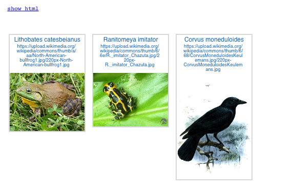
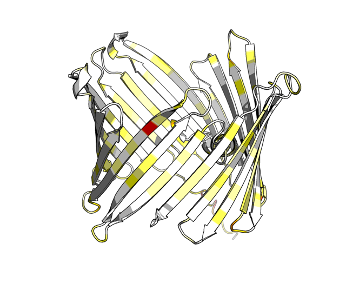

# Snippets-for-ColabFold
A collections of Pythonic snippets for working with ColabFold.
This may evolve into a proper Python package in the future. But for now, it's just a collection of snippets.

If you want to make it into a package, please feel free to use the snippets without any attribution or credit etc.

Due to the unplannedness, `AnalyseA3M` and `Blaster` reinvent each other.

## Note
These may be handy:

A Gist to convert a colab notebook to a Jupyter notebook:
[Gist: matteoferla/colab2jupyter.py](https://gist.github.com/matteoferla/15b483ab8f0c78293606dad91a360f9e)

A pip-module to import cleanly a given variable from a Gist, which features below
(clean, as in, without polluting the main namespace).
[pypi: gist-import](https://pypi.org/project/gist-import/)
> pip install gist-import

## Files herein

### AnalyseA3M

Don't blindly blame your MSA, Analyse what is in a a3m! [AnalyseA3M](analyse_a3m.py).
This fetches **Uniprot** details of the entries and returns a pandas DataFrame for easy analysis
(Colabfold-MMSeqs2 runs on Uniprot).

```python
from IPython.display import display

from gist_import import GistImporter
gi = GistImporter.from_github('https://github.com/matteoferla/Snippets-for-ColabFold/blob/main/analyse_a3m.py')
AnalyseA3M = gi['AnalyseA3M']

a3m = AnalyseA3M('VDAC2_BAK_tBID_2c974.a3m')
a3m.load_uniprot_data()
omnia = a3m.to_df()
boney = a3m.to_boney_subset()
print(f'{len(boney)} out of {len(omnia)} are tetrapods & boney-fish')
a3m.display_name_tallies(a3m.to_boney_subset())
display(boney.sample(5))
# And do whatever filtering:
# names are messy...
cleaned = boney.name_B.str.lower()\
                      .str.replace(r'( ?\d+)$','')\
                      .str.replace(r' proteinous','')\
                      .str.replace(r' protein','')\
                      .str.replace(r'bcl 2','bcl2')\
                      .str.strip()
# some homologues have question marks...
filtro = cleaned.isin(['bak', 'bcl2 antagonist/killer',
                           'bax regulator', 
                           #'bcl2', 'apoptosis regulator bcl 2',  # not sure.
                          # 'apoptosis regulator bcl',
                          # 'bcl domain containing'
                         ])
subsetted: pd.DataFrame = boney.loc[filtro & (boney.name_C == 'BH3 interacting domain death agonist')]
a3m.dump_a3m(subsetted, 'VDAC2_BAK_tBID_filtered.a3m')
```

### See animals

An addendum to the above is being able to see what the Latin name is...
This gist ([Gist wiki_species_photo.py](https://gist.github.com/matteoferla/313b5c7e1845f36205b4b9dcf05be10d))
has a class that when called with a species name gives the Wikipedia thumbnail.

```python
from IPython.display import display, Image
from gist_import import GistImporter

gi = GistImporter('313b5c7e1845f36205b4b9dcf05be10d')
WikiSpeciesPhoto = gi['WikiSpeciesPhoto']

w = WikiSpeciesPhoto('Lithobates catesbeianus', throw_error=True)
if w.preferred_name != w.species:
    print(f'{w.species} is commonly called {w.preferred_name}')
display(Image(w.image)) # image is a PIL image
```

So in the case of an A3M dataframe, one could do

```python
import operator
import functools
import pandas as pd
import ipyplot

df: pd.DataFrame = a3m.to_df()
subset: pd.DataFrame = df.loc[...]
wikis:pd.Series = subset.species.apply(functools.partial(WikiSpeciesPhoto, catch_error=True, retrieve_image=False))
urls:pd.Series = wikis.apply(operator.attrgetter('image_url'))
pretties = wikis.apply(operator.attrgetter('preferred_name'))
ipyplot.plot_images(urls.loc[~urls.isna()].values, 
                    pretties.loc[~urls.isna()].values,
                    img_width=150)
```


### Colour by diversity from A3M

Colour a PDB by the diversity of the A3M: [color_by_a3m_diversity](color_by_a3m_diversity.py).
Technically, it is just the AA count, so not really conservation as 
NB. American spelling is adopted within the code.

```python
from typing import List, Set
from gist_import import GistImporter
gi = GistImporter.from_github('https://github.com/matteoferla/Snippets-for-ColabFold/blob/main/color_by_a3m_diversity.py')
get_diversity = gi['get_diversity']
map_diversity = gi['map_diversity']
pdbblock:str = requests.get(f'https://alphafold.ebi.ac.uk/files/AF-{uniprot}-F1-model_v3.pdb').text
diversity:List[Set[str]] = get_diversity('foo.a3m')
map_diversity(pdbblock, diversity, outfile='foo.pse')
```



### Blast to A3M

This is very much WIP as the results are poor.
The test consists of concatenating high-similarity sequences before clustering and alignment.

```python
import pandas as pd
from typing import List, Set
from IPython.display import display
import functools
from gist_import import GistImporter
gi = GistImporter.from_github('https://github.com/matteoferla/Snippets-for-ColabFold/blob/main/blast_for_a3m.py')
Blaster = gi['Blaster']
get_common_species = gi['get_common_species']

# ## Do blasts via NBCI website
vdac2 = Blaster.from_uniprot('P45880')
bak = Blaster.from_uniprot('O08734')
tBID_seq = '...'
tbid = Blaster(tBID_seq)
# these will have a df as `results`
dfs = (vdac2.results, bak.results, tbid.results)
```
These tables may be rough... with gene we do not want to use.
The following will filter against a set of shortlists of names,
and return a df (`combo`) with the genes per species.

```python
# ## display what there is 
shortlisted = {'voltage-dependent anion-selective channel protein 1',
 'voltage-dependent anion-selective channel protein 2',
'BCL2 antagonist/killer 1 S homeolog',
 'apoptosis regulator BAX',
 'bcl-2 homologous antagonist/killer',
 'Bcl-2 homologous antagonist/killer 2',
'BH3 interacting domain death agonist',
 'BH3 interacting domain death agonist S homeolog',
 'BH3-interacting domain death agonist',}

dfs = [df.loc[df.names.apply(lambda l: map(Blaster.clean, l)).apply(set).apply(shortlisted.intersection).apply(len).astype(bool)] for df in dfs]
common: Set[str] = get_common_species(*dfs)

for df in dfs:
    has_common: pd.Series = df.specieses.apply(set).apply(common.intersection).apply(len).astype(bool)
    has_score: pd.Series = df.score > 100
    df['keep'] = has_common & has_score & df.novel_species

subdfs = [df.loc[df.keep] for df in dfs]
combo = pd.concat([df.set_index('common_species').matched_seq for df in subdfs], axis=1)
combo.columns=['VDAC2', 'BAK', 'tBID']
print(len(combo))
display((~combo.isna()).sum())
combo = combo.loc[combo.apply(lambda row: all([isinstance(row[col], str) for col in row.index]), axis=1)]
print('Species in final', len(combo))
for df in subdfs:
    cleaned = df.names.apply(lambda l: map(Blaster.clean, l)).apply(set)
    print('*'*20)
    display(functools.reduce(set.union, cleaned, set()))
```

Now things get horrible and experimental.

```python
# lets concatenate with an impossible to miss spacer.

junction = 'PWPWPWP'
with open('blasted.fa', 'w') as fh:
    for species, seq in combo.apply(lambda row: junction.join(row.to_list()), axis=1).iteritems():
        fh.write(f'>{species}\n{seq}\n')
```

```bash
# downloads
conda install -c conda-forge -c bioconda muscle hhsuite mmseqs2 -y
wget https://github.com/soedinglab/hh-suite/raw/master/scripts/reformat.pl
perl reformat.pl fas a3m test_msa.fasta test_msa.a3m -uc

$CONDA_DEFAULT_ENV/bin/mmseqs easy-cluster blasted.fa out out --min-seq-id 0.9 -c 0.9 --cov-mode 1
grep '>' out_rep_seq.fasta | wc -l
$CONDA_DEFAULT_ENV/bin/muscle -align out_rep_seq.fasta -output out_al.fasta
STOP manually reposition human on top
wget https://github.com/soedinglab/hh-suite/raw/master/scripts/reformat.pl
perl reformat.pl fas a3m out_al.fasta out.a3m
$CONDA_DEFAULT_ENV/bin/colabfold_batch test.clean.a3m test3 --cpu --model-type AlphaFold2-multimer-v2 --data '../ColabFoldData' --pair-mode paired
```

`$CONDA_DEFAULT_ENV` is a passed env variable to Python, so depending where bash it may not be visible.
The first two lines in a A3M for a concatenation go like:

    #👾,👾,👾	👻,👻,👻
    >101	102	103

where 👾 is the length of each peptide, 👻 is the cardinality (e.g. 1 = single copy),
the 101 etc. actually have cardinality in there, i.e. 100+👻.


### PyMOL alignment
Make pretty multimodel PyMOL alignment: [pymol_assemble](pymol_assemble.py)
```python
from gist_import import GistImporter
gi = GistImporter.from_github('https://github.com/matteoferla/Snippets-for-ColabFold/blob/main/pymol_assemble.py')
pymol_assemble = gi['align']

pymol_assemble(jobname='VDAC2_BAK_tBID_3693c', bg_color='white', use_shaders=0, ray_trace_mode=3)
```

### Chop up
Chop up an alphafold as a series of template with pLDDT > 70%: [chop](chop.py)

```python
from gist_import import GistImporter
gi = GistImporter.from_github('https://github.com/matteoferla/Snippets-for-ColabFold/blob/main/chop.py')
split_n_save = gi['split_n_save']

split_n_save('P45880', folder = 'templates')
```
## PyRosetta

PyRosetta notebooks for working with AF2 models are in:

[GitHub: matteoferla/pyrosetta_help](https://github.com/matteoferla/pyrosetta_help)

These include scoring interface, phosphorylating, stretching the termini etc.

It also includes porting ligands over, but a way better version has been release (different group)
called [AlphaFill](https://alphafill.eu/)

## See also

Uniprot ported gnomAD variants (AF2 runs off Uniprot and gnomAD off Ensembl 
and they differ in definition of caninical sequence):

[GitHub: matteoferla/Uniprot-ported-gnomADs](https://github.com/matteoferla/Uniprot-ported-gnomADs)

A series of PDBs for a blog post I will one day finish:

[GitHub: GitHub: matteoferla/autophagic-cell-death-complex-models](https://github.com/matteoferla/autophagic-cell-death-complex-models)


## Note

I am a biochemist not a geneticist.
I write in Python and do not use R. Please do not email me asking for a R snippet.

## Cluster Footnote

A collection of snippets for working with the University of Oxford's rescomp cluster (a SGE job scheduler system):
[GitHub: matteoferla/rescomp-tests](https://github.com/matteoferla/rescomp-tests)

But in terms of ColabFold on the cluster,
you need the internet for the MMSeq2 step (or make your own MSA). However, if you request zero models where there is 
internet it will generate a A3M. This can be used as a custom job on a node with no internet.
Note there is a hackish fix for now required — see below.

All my work in Rescomp is on a jupyter notebook forwarded from a private node.
Do not run notebooks in the log-in node. Sure, the R folk do it all the time, but do be a better citizen.
Get an interactive job instead.

```python
%%rescomp jobname=xxxx queue=short.qc cores=6
# needs to have had import rescomp on previous cell.

# hashed:
jobname = 'xxxx'
print(jobname)
print('no templates')
msa_mode = 'custom'
a3m_file = f"{jobname}.a3m"
result_dir="."
num_recycles = 3 # [1,3,6,12,24,48]
num_models = 5 # 5
dpi = 200

# ---------------------------------------------
import sys

from colabfold.download import download_alphafold_params, default_data_dir
from colabfold.utils import setup_logging
from colabfold.batch import get_queries, run, set_model_type
from colabfold.colabfold import plot_protein
from pathlib import Path
import matplotlib.pyplot as plt

setup_logging(Path(".").joinpath("log.txt"))
queries_path=f"{jobname}.csv"
queries_path=a3m_file
queries, is_complex = get_queries(queries_path)
run(
        queries=queries,
        result_dir='results',
        use_templates=False,
        custom_template_path=None,
        use_amber=False,
        msa_mode='custom',    
        model_type= "AlphaFold2-multimer-v2",
        num_models=num_models,
        num_recycles=num_recycles,
        model_order=[1, 2, 3, 4, 5],
        is_complex=is_complex,
        data_dir=Path("../ColabFoldData"),
        keep_existing_results=False,
        recompile_padding=1.0,
        rank_by="auto",
        pair_mode="unpaired+paired",
        stop_at_score=float(100),
        #prediction_callback=prediction_callback,
        dpi=dpi
)
```
## Shut up

If you are runnng 3.8 or above (Colab is stuck on 3.6), jax will yell at you things like
`FutureWarning: jax.tree_flatten is deprecated`. Supress it thusly:

```python
import warnings
warnings.simplefilter(action='ignore', category=FutureWarning)
```

## Hackish fix

Custom MSA in ColabFold version x.x.x blows up when paired alignments are passed.
Here is a fix:

```python
# hack the sourcecode!
from colabfold import batch

with open(batch.__file__, 'r') as fh:
    code = fh.read()
    
with open(batch.__file__.replace('.py', '.bk.py'), 'w') as fh:
    fh.write(code)
          
with open(batch.__file__, 'w') as fh:
    fh.write(code.replace('if unpaired_msa is None:', 'if unpaired_msa is None or unpaired_msa[sequence_index] == "":'))
```
## Blanking
Given positions that is not of interest for the complex, blank it with the value of the first sequence.
The following worked (check with color_by_a3m), but did not work for a satisfactory inference.
I have not improved or elaborated upon it.

I got the list of position in PyMOL, by aligning a model to a OPM model of a homologue and got everything
whose z axis was below a given value in the PDB —in Orientation of Protein in the Membrane (OPM) models,
the membrane is ± 12 Å or something from the xy plane. But one can dream up a thousand ways to do it.

```python
from typing import List, Optional, Tuple, Union, Dict

def get_alignment(alignment_filename:str):
    """This is a very simple reader... AnalyseA3M is better"""
    fh = open(alignment_filename, 'r')
    headers = []
    first_line = next(fh).strip()
    seqs = []
    seq = ''
    for line in fh:
        if not line:
            pass
        if line[0] == '>':
            headers.append(line.strip())
            if seq:
                seqs.append(seq)
                seq = ''
        else:
            seq += line.strip()
    seqs.append(seq)
    fh.close()
    return first_line, headers, seqs

def write_alignment(out_filename:str, first_line:str, headers:list, seqs:list):
    N = '\n'  # sloppiness from ye olde dayes
    out = open(out_filename, 'w')
    out.write(first_line + N)
    for header, seq in zip(headers, seqs):
        out.write(header + N)
        out.write(seq + N)
    out.close()
    
def blank_positions(seqs:List[str], exhaurienda:List[int], msa_offset:int=0):
    # `to empty out` in Latin is `exhaurio`
    """Converts the position (one indexed) specified to the same 
    as the first sequence in sequences. If the MSA is offset relative to the sequence, use ``msa_offset``"""
    exhaurienda: List[int] = [e - msa_offset for e in exhaurienda if e > msa_offset]
    ref = seqs[0]
    # replacements is zero indexed...
    replacements: Dict[int, str] = {c-1: ref[c-1] for c in exhaurienda}
    new_seqs: List[str] = [ref]
    for seq in seqs[1:]:
        nongap_replacements = {i: r for i, r in replacements.items() if seq[i] != '-'}
        new_seq:str = ''.join([nongap_replacements.get(i, s) for i, s in enumerate(seq)])
        new_seqs.append(new_seq)
    return new_seqs
```
